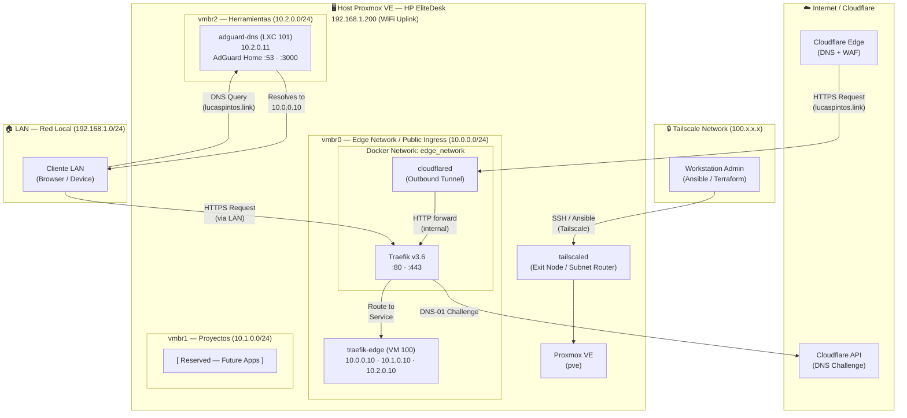

# homelab-infra — Proxmox IaC Lab

> **Fase 1 — Fundación de Red y Edge Gateway**
> Infrastructure as Code completo para un servidor físico Proxmox VE (HP EliteDesk Mini PC).
> Dominio: `lucaspintos.link`

---

## 📖 Visión General y Filosofía

Este repositorio es la **única fuente de verdad** para toda la infraestructura del home lab. Cada recurso de cómputo, configuración de red y servicio es declarado en código y ejecutado mediante herramientas deterministas. El servidor nunca se toca a mano en producción; si algo se rompe, se reconstruye desde este repositorio.

### Principios de Diseño

| Principio | Implementación |
|---|---|
| **GitOps** | El estado deseado del servidor vive en `main`. Ningún cambio manual es válido. |
| **Infraestructura Inmutable** | Las VMs no se parchean; se destruyen y se reaprovisionan desde la plantilla Packer. |
| **Zero-Trust Networking** | No hay puertos abiertos a Internet. El acceso externo fluye exclusivamente por Cloudflare Tunnel. Tailscale provee acceso de administración. |
| **Segregación de Red** | Tres redes L2 aisladas con propósitos distintos. El enrutamiento entre zonas es explícito y controlado. |
| **Secretos fuera de Git** | Credenciales en archivos `.pkrvars.hcl` y `.tfvars` locales (git-ignorados). Se proveen archivos `.example` para documentación. |

### Stack Tecnológico

```
Hardware:   HP EliteDesk Mini PC
Hypervisor: Proxmox VE (nodo: pve)
Dominio:    lucaspintos.link
VPN Admin:  Tailscale (Exit Node + Subnet Router en el host)

IaC Layer:
  ├── Packer      — Golden Image: Ubuntu 24.04 LTS + Cloud-init
  ├── Terraform   — Aprovisionamiento de VMs y LXC (provider: bpg/proxmox)
  └── Ansible     — Configuración y despliegue de servicios

Edge Stack:
  ├── Traefik v3.6        — Reverse Proxy (Docker)
  ├── Cloudflare Tunnel   — Ingress sin puertos abiertos (Docker)
  └── AdGuard Home        — Split-Brain DNS (binario systemd en LXC)
```

---

## 🌐 Arquitectura y Topología de Red

### Subredes (Linux Bridges en Proxmox)

El host provee tres puentes Linux virtuales, cada uno aislado como segmento L2 independiente. El NAT hacia Internet se hace vía `iptables MASQUERADE` sobre la interfaz WiFi (`wlp0s20f3`, IP `192.168.1.200/24`).

| Bridge | Zona | Subred | Gateway (Host) | Propósito |
|--------|------|--------|----------------|-----------|
| `vmbr0` | **Edge Network** (Public Ingress) | `10.0.0.0/24` | `10.0.0.1` | Punto de entrada de tráfico externo. `traefik-edge` vive aquí e intercepta todo el ingreso desde Cloudflare Tunnel. |
| `vmbr1` | **Proyectos** | `10.1.0.0/24` | `10.1.0.1` | VMs de proyectos internos (apps, bases de datos). |
| `vmbr2` | **Herramientas** | `10.2.0.0/24` | `10.2.0.1` | Infraestructura interna del lab (DNS, monitoreo, herramientas). |

> **Nota sobre `traefik-edge`:** Esta VM tiene tres interfaces de red (una por cada bridge) con IPs estáticas distintas pero **un solo gateway** configurado en `vmbr0` (`10.0.0.1`) para evitar ruteo asimétrico. Sus interfaces en `vmbr1` y `vmbr2` no tienen gateway.

### Diagrama de Arquitectura



### Flujos de Tráfico

**Flujo Público (Exit Internet → Servicio):**
```
Usuario → DNS Cloudflare → cloudflared (outbound tunnel) → Traefik v3.6 → Servicio
```
No hay ningún puerto TCP/UDP abierto en el router del hogar. El tunnel saliente de `cloudflared` es quien establece la conexión con Cloudflare.

**Split-Brain DNS (LAN → Servicio por IP Interna):**
```
Cliente LAN → AdGuard Home (10.2.0.11:53) → Resuelve *.lucaspintos.link a 10.0.0.10 → Traefik
```
Evita el hairpin NAT y reduce latencia. Los clientes de la LAN llegan al servicio directamente vía la red interna sin salir a Internet.

**Administración (Admin → Proxmox):**
```
Workstation → Tailscale → Host Proxmox (Subnet Router) → API / Shell
```

---

## 📊 Mapa de Infraestructura Actual (Fase 1)

| Nodo | ID | Hostname | Tipo | IP Principal | Redes (Bridges) | Servicios / Puertos |
|------|----|----------|------|-------------|-----------------|---------------------|
| `pve` | `9000` | `ubuntu-2404-template` | **Packer Template** | N/A (no activa) | `vmbr0` | Plantilla base. No se ejecuta. |
| `pve` | `100` | `traefik-edge` | **VM** (2 vCPU / 4 GB / 20 GB) | `10.0.0.10` | `vmbr0` · `vmbr1` · `vmbr2` | Traefik `:80`/`:443` · Dashboard `traefik.lucaspintos.link` |
| `pve` | `101` | `adguard-dns` | **LXC** (1 vCPU / 512 MB / 4 GB) | `10.2.0.11` | `vmbr2` | AdGuard Home `:53` (DNS) · `:3000` (Web UI) |

> El LXC `adguard-dns` corre en modo **unprivileged** con `nesting = true`.

---

## 🗂 Estructura del Repositorio

```
proxmox-l10s/
│
├── etc/
│   └── network/
│       └── interfaces              # Configuración de red del host Proxmox
│                                   # (NAT iptables + bridges vmbr0/1/2)
│
├── packer/
│   └── ubuntu-2404/
│       ├── ubuntu-2404.pkr.hcl    # Definición de la Golden Image
│       ├── secrets.pkrvars.hcl.example  # Plantilla de credenciales (NO commitear .pkrvars.hcl)
│       └── http/
│           └── user-data.pkrtpl.hcl    # Cloud-init autoinstall (Ubuntu 24.04)
│
├── terraform/
│   ├── modules/
│   │   └── proxmox_vm/            # Módulo reutilizable para VMs Proxmox
│   │       ├── main.tf            # Recurso proxmox_virtual_environment_vm
│   │       ├── variables.tf       # Interfaz del módulo (nombre, red, disco, etc.)
│   │       ├── outputs.tf         # Outputs del módulo
│   │       └── providers.tf
│   │
│   ├── edge_gateway/              # Workspace: traefik-edge (VM 100)
│   │   ├── main.tf                # Llama al módulo proxmox_vm para traefik-edge
│   │   ├── variables.tf
│   │   ├── providers.tf
│   │   └── terraform.tfvars.example  # Plantilla de credenciales
│   │
│   ├── apps_lxc/
│   │   └── adguard/               # Workspace: adguard-dns (LXC 101)
│   │       ├── main.tf            # Recurso proxmox_virtual_environment_container
│   │       ├── variables.tf
│   │       ├── providers.tf
│   │       └── terraform.tfvars.example
│   │
│   └── apps_vms/                  # (Reservado — Fase 2)
│
└── ansible/
    ├── ansible.cfg                # Configuración global de Ansible
    ├── requirements.yml           # Colecciones requeridas (community.docker, etc.)
    │
    ├── inventory/
    │   ├── hosts.yml              # Inventario estático (grupos: edge, tools, apps)
    │   └── group_vars/
    │       └── edge/
    │           ├── secrets.yml            # Credenciales reales (git-ignorado)
    │           └── secrets.yml.example    # Plantilla de variables secretas
    │
    ├── playbooks/
    │   ├── edge.yml               # Playbook: configura traefik-edge (docker_setup + edge_proxy)
    │   └── adguard.yml            # Playbook: instala AdGuard Home en el LXC
    │
    └── roles/
        ├── docker_setup/          # Rol: instala Docker CE en Ubuntu
        ├── edge_proxy/            # Rol: despliega Traefik + Cloudflare Tunnel vía Docker Compose
        │   ├── defaults/main.yml  # Variables: rutas, dominio, nombre de red Docker
        │   ├── tasks/main.yml     # Tareas: directorios, templates, docker_compose_v2
        │   ├── handlers/          # Handler: restart del edge stack ante cambios
        │   └── templates/
        │       ├── traefik.yml.j2          # Config estática de Traefik (entrypoints, ACME)
        │       └── docker-compose.yml.j2   # Stack Docker (traefik + cloudflared)
        └── adguard_setup/         # Rol: instala AdGuard Home (binario oficial + systemd)
            └── tasks/main.yml     # Idempotente: verifica binario y servicio antes de instalar
```

---

## 🔐 Gestión de Secretos

El repositorio hace un uso estricto de la estrategia **secrets-out-of-git**: ningún valor sensible se almacena en el historial de commits.

### Archivos de Secretos y sus Plantillas

| Ruta del Secreto (git-ignorado) | Plantilla de Referencia | Herramienta | Variables Contenidas |
|---|---|---|---|
| `packer/ubuntu-2404/secrets.pkrvars.hcl` | `secrets.pkrvars.hcl.example` | Packer | API URL Proxmox, token ID/secret, clave SSH pública |
| `terraform/edge_gateway/terraform.tfvars` | `terraform.tfvars.example` | Terraform | API URL/token Proxmox, usuario SSH, clave pública |
| `terraform/apps_lxc/adguard/terraform.tfvars` | `terraform.tfvars.example` | Terraform | API URL/token Proxmox, clave pública, contraseña root LXC |
| `ansible/inventory/group_vars/edge/secrets.yml` | `secrets.yml.example` | Ansible | Cloudflare Tunnel Token, DNS API Token, Traefik BasicAuth hash |

### Workflow de Secretos

```bash
# 1. Clonar el repositorio en una máquina nueva
git clone <repo-url> && cd proxmox-l10s

# 2. Copiar y rellenar CADA archivo de secretos
cp packer/ubuntu-2404/secrets.pkrvars.hcl.example \
   packer/ubuntu-2404/secrets.pkrvars.hcl
# → Editar con valores reales

cp terraform/edge_gateway/terraform.tfvars.example \
   terraform/edge_gateway/terraform.tfvars
# → Editar con valores reales

cp terraform/apps_lxc/adguard/terraform.tfvars.example \
   terraform/apps_lxc/adguard/terraform.tfvars
# → Editar con valores reales

cp ansible/inventory/group_vars/edge/secrets.yml.example \
   ansible/inventory/group_vars/edge/secrets.yml
# → Editar con valores reales
```

### Detalle de Variables Secretas (Ansible — `edge` group_vars)

```yaml
# Cloudflare Tunnel Token
# Origen: Cloudflare Dashboard → Zero Trust → Networks → Tunnels → Create → Token
cloudflare_tunnel_token: "CHANGE-ME"

# Cloudflare DNS API Token (para ACME DNS Challenge)
# Origen: Cloudflare Dashboard → My Profile → API Tokens → Zone:DNS:Edit
cloudflare_dns_api_token: "CHANGE-ME"

# Traefik Dashboard BasicAuth (usuario:hash_bcrypt)
# Generar con: htpasswd -nB admin
# IMPORTANTE: los $ deben escaparse como $$ para Docker Compose
traefik_dashboard_auth: "admin:$$2y$$05$$CHANGE_ME_WITH_HTPASSWD_HASH"
```

---

## 🚀 Guía de Despliegue — Playbook de Recuperación Total

Esta sección describe cómo reconstruir **toda** la infraestructura desde cero, empezando desde un Proxmox VE recién instalado. Seguir el orden es obligatorio.

### Pre-requisitos

- Proxmox VE instalado en el hardware. Nodo nombrado `pve`.
- ISO de Ubuntu 24.04 LTS subida al storage `local` de Proxmox (`local:iso/ubuntu-24.04.2-live-server-amd64.iso`).
- Packer ≥ 1.11, Terraform ≥ 1.9, Ansible ≥ 2.17 instalados en la workstation.
- Tailscale instalado y configurado como Exit Node / Subnet Router en el host Proxmox.
- Todos los archivos `.pkrvars.hcl`, `.tfvars` y `secrets.yml` creados y rellenos (ver sección anterior).

---

### Paso 0 — Configurar la Red del Host Proxmox

Copiar el archivo de interfaces al host Proxmox y aplicar la configuración:

```bash
# Desde la workstation (vía SSH o Tailscale)
scp etc/network/interfaces root@pve:/etc/network/interfaces

# En el host Proxmox
ifreload -a
# O reiniciar el host (más seguro para aplicar bridges)
reboot
```

Esto crea los bridges `vmbr0` (10.0.0.1/24 — Edge Network), `vmbr1` (10.1.0.1/24 — Proyectos) y `vmbr2` (10.2.0.1/24 — Herramientas) con sus reglas NAT correspondientes.

---

### Paso 1 — Construir la Golden Image con Packer (Template ID 9000)

```bash
cd packer/ubuntu-2404

# Inicializar plugins
packer init .

# Construir la plantilla base de Ubuntu 24.04
# (la VM se levanta, se instala, y se convierte a template automáticamente)
packer build \
  -var-file="secrets.pkrvars.hcl" \
  ubuntu-2404.pkr.hcl
```

**Qué hace este paso:**
- Crea la VM `ubuntu-2404-template` (ID `9000`) en Proxmox.
- Usa el autoinstaller de Ubuntu con `cloud-init` vía CD-ROM (no requiere DHCP).
- Instala `qemu-guest-agent`, Python 3, herramientas base.
- Bloquea login por contraseña (solo SSH key).
- Ejecuta `cloud-init clean` y convierte la VM en template.

---

### Paso 2 — Aprovisionar la VM `traefik-edge` con Terraform (VM ID 100)

```bash
cd terraform/edge_gateway

# Descargar el provider bpg/proxmox
terraform init

# Verificar el plan de cambios
terraform plan -var-file="terraform.tfvars"

# Aplicar: crea la VM clonando el template 9000
terraform apply -var-file="terraform.tfvars"
```

**Qué crea:**
- VM `traefik-edge` (ID `100`) clonada del template `9000`.
- 2 vCPU, 4 GB RAM, disco 20 GB en `local-lvm`.
- Tres interfaces de red:
  - `vmbr0`: `10.0.0.10/24`, gateway `10.0.0.1`
  - `vmbr1`: `10.1.0.10/24`, sin gateway
  - `vmbr2`: `10.2.0.10/24`, sin gateway

---

### Paso 3 — Aprovisionar el LXC `adguard-dns` con Terraform (LXC ID 101)

```bash
cd terraform/apps_lxc/adguard

# Descargar el provider bpg/proxmox
terraform init

# Verificar el plan de cambios
terraform plan -var-file="terraform.tfvars"

# Aplicar: descarga el template LXC de Ubuntu y crea el contenedor
terraform apply -var-file="terraform.tfvars"
```

**Qué crea:**
- Descarga el template LXC oficial `ubuntu-24.04-standard_24.04-2_amd64.tar.zst` desde Proxmox CDN.
- Contenedor `adguard-dns` (ID `101`) en modo unprivileged con nesting.
- 1 vCPU, 512 MB RAM, disco 4 GB en `local-lvm`.
- Red: `vmbr2`, IP `10.2.0.11/24`, gateway `10.2.0.1`.

---

### Paso 4 — Instalar colecciones Ansible

```bash
cd ansible

# Instala las colecciones requeridas (community.docker, etc.)
ansible-galaxy collection install -r requirements.yml
```

---

### Paso 5 — Configurar Edge Gateway: Docker + Traefik + Cloudflare Tunnel

```bash
cd ansible

# Asegurarse de que secrets.yml está en su lugar
ls inventory/group_vars/edge/secrets.yml

# Ejecutar el playbook (instala Docker CE, despliega el stack de Docker Compose)
ansible-playbook playbooks/edge.yml
```

**Qué hace este playbook:**

1. **Rol `docker_setup`**: instala Docker CE en `traefik-edge` siguiendo el método oficial (keyring + apt repo).
2. **Rol `edge_proxy`**:
   - Crea los directorios `/opt/edge_stack/traefik/{dynamic,acme}`.
   - Genera `traefik.yml` desde template Jinja2 (entrypoints :80/:443, DNS Challenge ACME con Cloudflare, file provider en `/dynamic`, docker provider).
   - Genera `docker-compose.yml` desde template Jinja2 con los servicios `traefik` y `cloudflared`, inyectando los tokens desde `secrets.yml`.
   - Crea la red Docker `edge_network`.
   - Levanta el stack con `docker compose up -d`.
   - El dashboard de Traefik queda disponible en `traefik.lucaspintos.link` con BasicAuth.

---

### Paso 6 — Configurar DNS: AdGuard Home

```bash
cd ansible

# Instalar AdGuard Home en el LXC
ansible-playbook playbooks/adguard.yml
```

**Qué hace este playbook:**

1. **Rol `adguard_setup`** (idempotente):
   - Crea el directorio `/opt/AdGuardHome`.
   - Verifica si el binario ya existe antes de descargar.
   - Descarga y extrae `AdGuardHome_linux_amd64.tar.gz` desde `static.adguard.com`.
   - Verifica si el servicio systemd ya está registrado.
   - Registra AdGuard Home como servicio systemd (`AdGuardHome -s install`).
   - Habilita e inicia `AdGuardHome.service`.
2. **Post-instalación manual**: Acceder a `http://10.2.0.11:3000` para completar el wizard de AdGuard Home y configurar las reglas de DNS rewrite para `*.lucaspintos.link → 10.0.0.10`.

---

### Resumen Visual del Orden de Despliegue

```
[Host Proxmox]
      │
      ▼ Paso 0: Configurar /etc/network/interfaces (vmbr0/1/2 + NAT)
      │
      ▼ Paso 1: Packer → Template ubuntu-2404-template (ID 9000)
      │
      ├─► Paso 2: Terraform edge_gateway → VM traefik-edge (ID 100)
      │
      ├─► Paso 3: Terraform apps_lxc/adguard → LXC adguard-dns (ID 101)
      │
      ▼ Paso 4: ansible-galaxy collection install -r requirements.yml
      │
      ├─► Paso 5: ansible-playbook edge.yml → Docker + Traefik + Cloudflare Tunnel
      │
      └─► Paso 6: ansible-playbook adguard.yml → AdGuard Home systemd
```

---

## 🔧 Referencia de Comandos Rápidos

```bash
# Reconstruir SOLO la VM traefik-edge (sin tocar el LXC)
cd terraform/edge_gateway && terraform destroy && terraform apply

# Re-aplicar configuración Ansible en traefik-edge (ej: tras cambiar secrets.yml)
cd ansible && ansible-playbook playbooks/edge.yml

# Re-aplicar configuración Ansible en AdGuard
cd ansible && ansible-playbook playbooks/adguard.yml

# Ver el estado actual de Terraform del edge gateway
cd terraform/edge_gateway && terraform show

# Ver el estado actual de Terraform del LXC de AdGuard
cd terraform/apps_lxc/adguard && terraform show

# Validar un playbook sin ejecutarlo
ansible-playbook playbooks/edge.yml --check --diff

# Conectar por SSH a traefik-edge
ssh lpintos@10.0.0.10

# Conectar por SSH al LXC adguard-dns
ssh root@10.2.0.11
```

---

## 📌 Variables de Referencia

### Packer (`packer/ubuntu-2404/ubuntu-2404.pkr.hcl`)

| Variable | Default | Descripción |
|---|---|---|
| `proxmox_api_url` | — | URL de la API de Proxmox |
| `proxmox_api_token_id` | — | Token ID (ej: `root@pam!packer-token`) |
| `proxmox_api_token_secret` | — | Secret del API token |
| `proxmox_node` | `pve` | Nombre del nodo Proxmox |
| `vm_id` | `9000` | ID del template resultante |
| `template_name` | `ubuntu-2404-template` | Nombre del template |
| `ssh_username` | `lpintos` | Usuario admin creado en la VM |
| `ssh_public_key` | — | Clave pública SSH para acceso |
| `ssh_private_key_file` | `~/.ssh/id_ed25519` | Clave privada para el build |
| `vm_ip` | `10.0.0.100` | IP temporal de build |
| `vm_gateway` | `10.0.0.1` | Gateway durante el build |
| `vm_dns` | `8.8.8.8,8.8.4.4` | DNS durante el build |
| `iso_file` | `local:iso/ubuntu-24.04.2-live-server-amd64.iso` | ISO ya cargada en Proxmox |

### Terraform — Módulo `proxmox_vm`

| Variable | Default | Descripción |
|---|---|---|
| `name` | — | Nombre de la VM |
| `vm_id` | `null` | ID de la VM en Proxmox |
| `template_vmid` | — | ID del template Packer a clonar |
| `cpu_cores` | `2` | Cores de vCPU |
| `memory` | `2048` | RAM en MB |
| `disk_size` | `20` | Disco en GB |
| `datastore_id` | `local-lvm` | Storage pool |
| `network_interfaces` | — | Lista de objetos `{bridge, address, gateway}` |
| `ssh_username` | — | Usuario admin |
| `ssh_public_key` | — | Clave pública SSH |

### Ansible — Rol `edge_proxy` (`defaults/main.yml`)

| Variable | Valor | Descripción |
|---|---|---|
| `edge_stack_dir` | `/opt/edge_stack` | Directorio raíz del stack |
| `traefik_dynamic_dir` | `/opt/edge_stack/traefik/dynamic` | File provider para rutas dinámicas |
| `traefik_acme_dir` | `/opt/edge_stack/traefik/acme` | Almacenamiento de certificados ACME |
| `docker_network_name` | `edge_network` | Red Docker compartida |
| `domain` | `lucaspintos.link` | Dominio principal |

---

## 🗺 Roadmap — Próximas Fases

- **Fase 2:** Despliegue de aplicaciones en `vmbr1` (Proyectos). Incorporar nuevas VMs usando el módulo `proxmox_vm` reutilizable. Agregar rutas `file` en Traefik para enrutarlas.
- **Fase 3:** Observabilidad — Prometheus + Grafana + Loki en `vmbr2` (Herramientas).
- **Fase 4:** Gestión de secretos con Vault o Ansible Vault.
- **Fase 5:** Pipeline CI/CD para validar cambios en Terraform/Ansible antes de mergear a `main`.

---

*Documentación generada el 2026-03-17 · Estado: Fase 1 completada*